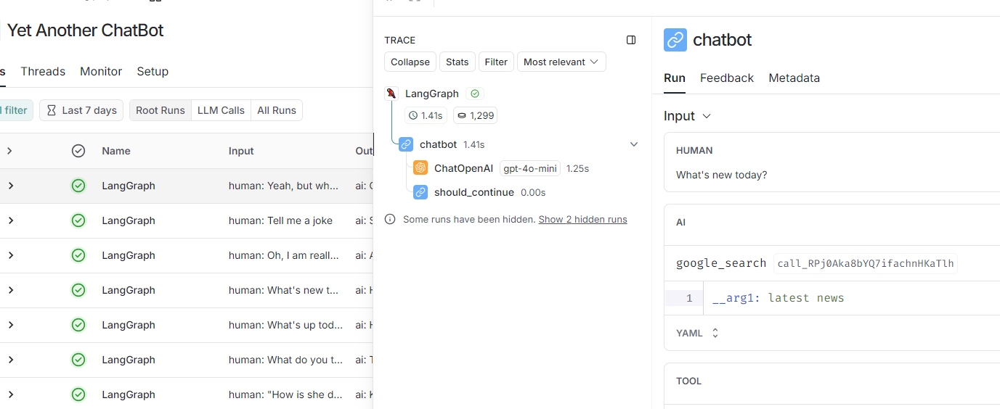

# ✨Yet Another ChatBot ✨

<p align="justify">
This repository contains a simple chatbot application developed using <strong>Streamlit</strong> for 
the user interface and <strong>LangChain</strong> as the framework to manage interactions with the 
LLM. The chatbot provides real-time, dynamic responses using <strong>OpenAI’s GPT models</strong> and 
<strong>Google Search Engine</strong> for up-to-date information retrieval. 
<strong>LangSmith</strong> is integrated to monitor and analyze the chatbot’s performance in 
production, helping to track conversation flows and detect potential issues.
</p>

1. [Why LangChain? 🤔](#why-langchain-)
2. [How to run it? 🛠](#how-to-run-it-)
3. [Demo 🏃🏻](#demo-)

## Why LangChain? 🤔 
<p align="justify">
<strong>LangChain</strong> is a framework that simplifies the process of building applications 
powered by LLMs. It provides tools to streamline development, maintenance, and 
monitoring.

* **LangChain** - integrates easily with APIs, including those for LLMs and external 
tools like search engines.
* **LangGraph** - helps define conversation flows and decision-making processes, 
improving chatbot performance by boosting responses with the latest data from web 
searches. It also supports seamless response streaming.
* **LangSmith** - simplifies monitoring and logging by tracking all interactions 
between the LLM and connected tools, helping debug and optimize performance efficiently.
</p>

<div style="text-align: center;">
  
</div>

## How to run it? 🛠

First, clone the repository from GitHub on your local machine:
```bash
git clone https://github.com/MrCrowley21/Yet_Another_ChatBot.git  //clone the repo
```

After you get the repository on your local machine, create a `.env` file and fill it as in 
the provided example (`.env.example`).

### Running on local machine 💻
To run the application on the local machine, run the following commands
```bash
pip install -r requirements.txt //install all the required libraries
streamlit run Chat.py  //run the Streamlit app
```

### Running in Docker 🐳
To run the application in Docker, ensure you have Docker on your machine, 
then run the following commands:
```bash
docker build -t chatbot_image . //build Docker image
docker run -p 8501:8501 --name yet_another_chatbot chatbot_image  //run the container on the built image
```
